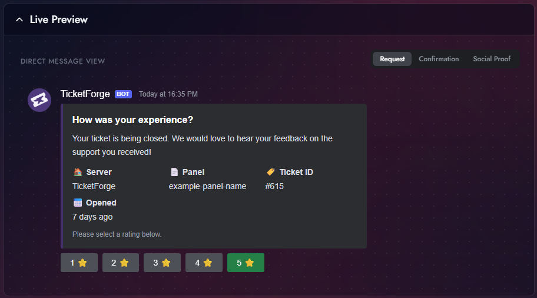

# Rating System (CSAT)

Gather feedback on your support team's performance by asking users to rate their experience after a ticket concludes.

## Configuration

1.  Go to the **Rating System** tab in the Panel Editor.
2.  **Enable** the system.

!!! info "Two-Step Close"
    Enabling the Rating System automatically forces **Two-Step Close** (Confirmation Mode). The rating request replaces the standard "Confirm Close" prompt.

## Request Methods

You can choose how the user is asked for feedback:

- **Ticket Channel (Recommended):** The bot posts an embed with 1-5 Star buttons inside the ticket channel.
- **Direct Message:** The bot DMs the user with the rating request.
- **Hybrid:** Tries to DM the user first; if DMs are closed, it posts in the channel.

<figure markdown>
  { loading=lazy width="450" }
  <figcaption>The rating prompt users receive before a ticket closes.</figcaption>
</figure>

## Social Proof (Public Feed)

You can select a **Public Feed Channel** (e.g., `#reviews`). When a user submits a 4 or 5-star rating, the bot will automatically post a standardized "Review Card" in that channel to showcase your community's satisfaction.

<figure markdown>
  { loading=lazy width="450" }
  <figcaption>An example of a positive review posted to the public feed.</figcaption>
</figure>

## Analytics

All ratings are aggregated in the **Statistics** page.

- **CSAT Score:** Average star rating (1.0 - 5.0).
- **NPS (Net Promoter Score):** Calculated based on the ratio of Promoters (5 stars) vs Detractors (1-3 stars).
- **Staff Leaderboard:** See which staff members are receiving the highest ratings (based on who claimed the ticket or replied last).

<figure markdown>
  { loading=lazy }
  <figcaption>The statistics dashboard showing CSAT scores and staff performance.</figcaption>
</figure>