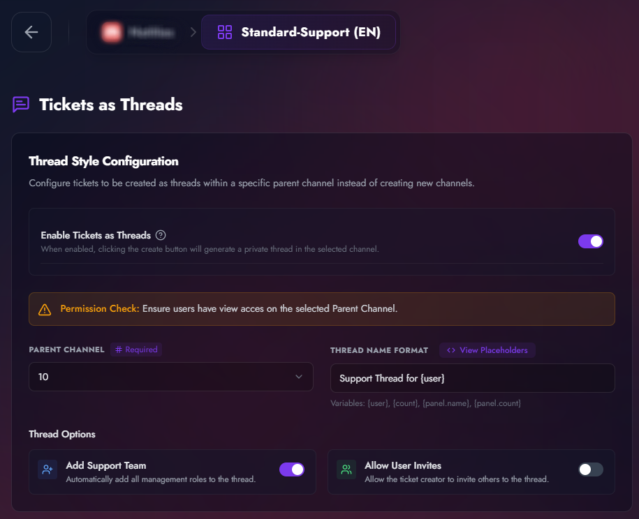
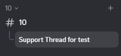

# Tickets as Threads

By default, TicketForge creates a new text channel for every ticket. The **Tickets as Threads** feature allows you to generate tickets as private Discord threads within a specific parent channel, keeping your server sidebar clean and organized.

## Configuration

Navigate to your panel settings to find the **Thread Style Configuration** card.

<figure markdown>
  { loading=lazy }
  <figcaption>The Thread Style Configuration interface in the TicketForge dashboard.</figcaption>
</figure>

### 1. Enable Tickets as Threads
Toggle this setting to change the fundamental behavior of the panel. When enabled, clicking the "Create Ticket" button will generate a **private thread** instead of a standard text channel.

### 2. Parent Channel
Select the text channel where new threads will be spawned. 

!!! warning "Permission Check"
    Ensure your users have **View Channel** access to the selected Parent Channel. If they cannot see the parent channel, they will be unable to access their ticket threads.

### 3. Thread Name Format
Customize how the thread appears in the list. You can use dynamic variables to include user info or ticket counts.

**Available Placeholders:**
*   `{user}`: The username of the ticket creator.
*   `{count}`: The total ticket count for the server.
*   `{panel.name}`: The name of the panel.
*   `{panel.count}`: The number of tickets created specifically through this panel.

*Default: `ticket-{count}`*

---

## Thread Options

You can fine-tune how the thread behaves once it is opened using the following toggles:

| Option | Description |
| :--- | :--- |
| **Add Support Team** | Automatically adds all roles designated as "Support" or "Admin" to the thread immediately upon creation. |
| **Allow User Invites** | When enabled, the ticket creator (non-moderator) is allowed to invite other users to the thread. |

---

## Benefits of using Threads

## Benefits of using Threads
*   **Reduced Sidebar Clutter:** Prevent "Channel Overload" by nesting tickets under a single support channel.
*   **Privacy:** All threads created are **Private**, meaning they are not visible to anyone except the creator, staff, and specifically invited users.
*   **Bypass Discord Limits:** Discord restricts servers to 500 total channels and categories, and restricts each category to only 50 channels. **Threads do not count toward these limits.** By using threads, your server can manage up to 1,000 active tickets simultaneously without ever hitting Discord's channel or category caps.

<figure markdown>
  { loading=lazy }
  <figcaption>Example of how tickets appear nested as threads within Discord.</figcaption>
</figure>