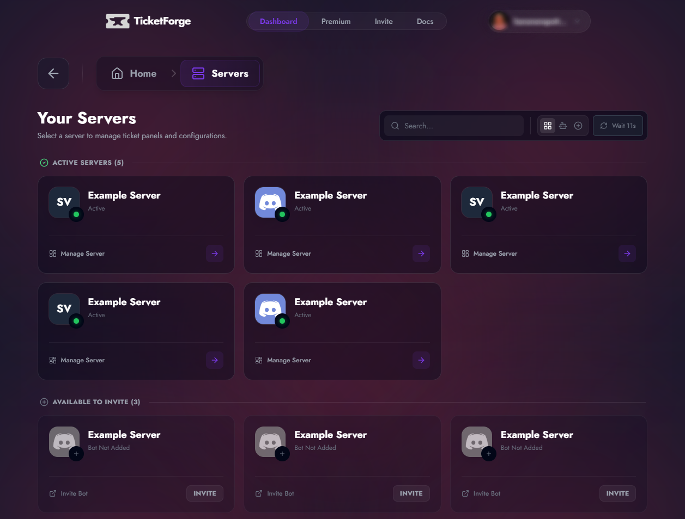

# Dashboard Overview

The TicketForge Dashboard is the control center for your ticketing system. It allows you to configure everything visually without needing to memorize complex commands.

[Access Dashboard](https://ticketforge.xyz){ .md-button .md-button--primary }

## 1. Server Selection

After logging in via Discord, you will see the **Server List**.

- **Active Servers:** Servers where TicketForge is already present. Click **Manage** to enter the configuration area.
- **Available Servers:** Servers where you have administrative rights but the bot is missing. Click **Invite** to add it.

{ loading=lazy }

## 2. Navigation Sidebar

Once you select a server, the sidebar provides access to specific tools:

| Section                                         | Description                                                                                          |
| :---------------------------------------------- | :--------------------------------------------------------------------------------------------------- |
| :material-view-dashboard-edit: **Panel Editor** | The core builder. Create reaction panels, configure buttons, and set up ticket logic.                |
| :material-console: **Commands**                 | Enable/Disable specific slash commands (`/close`, `/claim`, etc.) and set role/channel restrictions. |
| :material-cog: **Server Config**                | Global settings like the **Dashboard Access Roles**, **Language**, and **Ticket Limits**.            |
| :material-history: **History**                  | An audit log of all changes made to your bot configuration via the dashboard.                        |
| :material-chart-bar: **Statistics**             | View charts regarding ticket volume, claim times, and staff activity.                                |
| :material-crown: **Premium**                    | Manage your subscription, view invoices, or activate a license key.                                  |

## 3. Top Navigation

- **Server Context:** The top left shows which server you are currently editing.
- **User Profile:** The top right allows you to switch accounts or log out.
- **Quick Switch:** Use the sidebar dropdown (if available) to quickly jump between different panels in the same server.

## 4. Saving Changes

!!! note "Unsaved Changes"
    The dashboard includes a **Safe Save** system. If you make changes (e.g., edit a message or toggle a setting), a bar will appear at the bottom of the screen prompting you to **Save Changes** or **Discard**.

    If you try to leave the page with unsaved changes, a confirmation modal will prevent you from losing your work.
