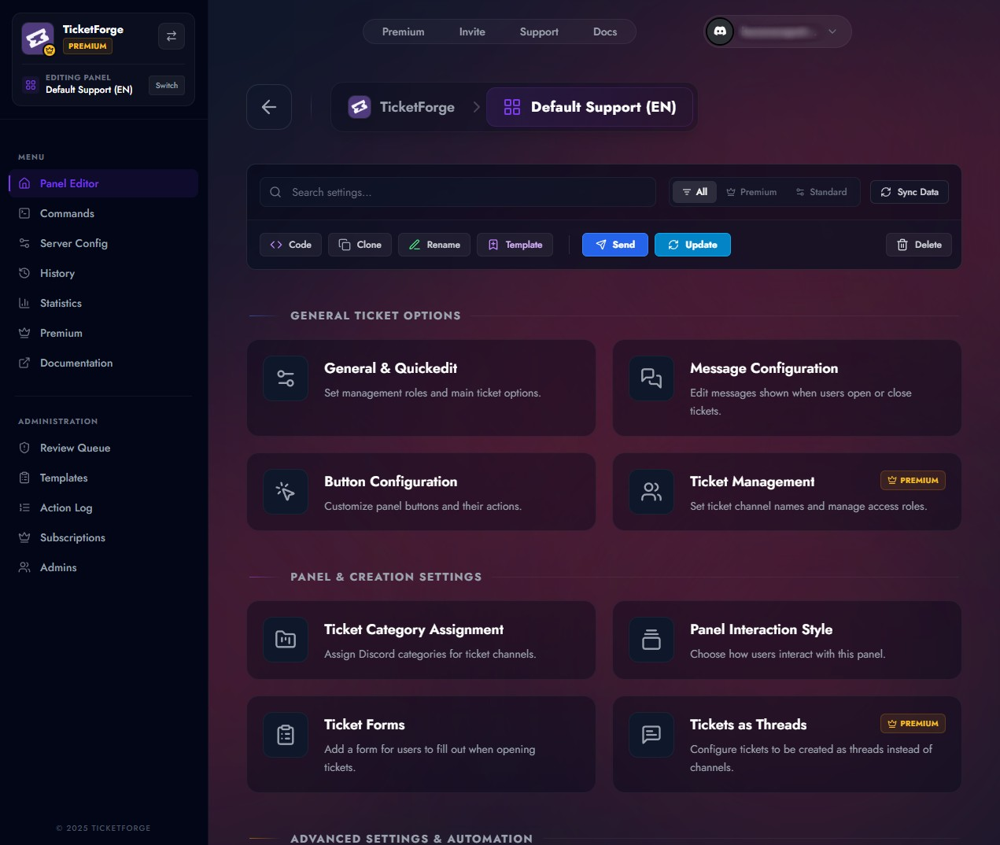

# Welcome to TicketForge

**TicketForge** is the ultimate Discord ticketing bot designed to streamline support requests, automate workflows, and organize your community interactions.

Whether you are running a small gaming community or a large enterprise server, TicketForge allows you to manage support requests through an intuitive web dashboard.

- :material-rocket-launch: **Getting Started** 
  Learn how to invite the bot and set up your first support panel in minutes. 
  [:octicons-arrow-right-24: Installation](getting-started/installation.md)

- :material-view-dashboard-edit: **Panel Configuration** 
  Customize embeds, buttons, dropdowns, and intake forms to fit your brand. 
  [:octicons-arrow-right-24: Create Panels](panels/create.md)

- :material-robot: **Automation** 
  Set up auto-replies, auto-closing, and transcript logging to save your staff time. 
  [:octicons-arrow-right-24: Automation](features/automation.md)

- :material-crown: **Premium** 
  Unlock advanced limits, statistics, and white-label features. 
  [:octicons-arrow-right-24: Premium Plans](premium/plans.md)

<figure markdown>
  { loading=lazy }
  <figcaption>Manage your tickets, panels, and settings from a beautiful web dashboard.</figcaption>
</figure>

## Key Features

Based on our powerful web dashboard, TicketForge offers:

- **Intuitive Ticket Creation:** Enable users to open tickets via Buttons or Select Menus.
- **Custom Forms:** Collect specific information using modal forms.
- **Smart Automation:** Automatically close inactive tickets or assign roles.
- **Claiming System:** Prevent staff collisions by allowing moderators to "Claim" a ticket.

## Need Help?

If you can't find what you are looking for, join our support server.

[Join Support Server](https://discord.gg/ya3Rv9VmpR){ .md-button .md-button--primary }