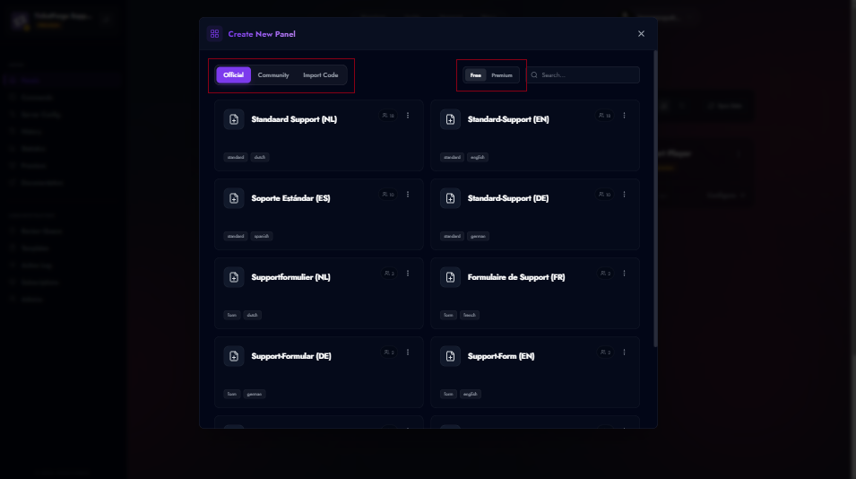
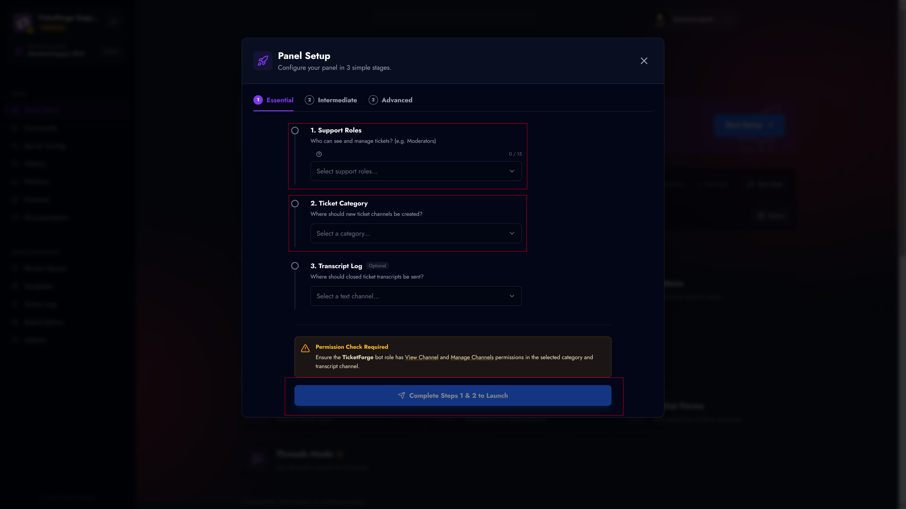

# Creating a Panel

A **Panel** is the interface your users interact with on Discord to open tickets. TicketForge allows you to create multiple panels for different purposes (e.g., "General Support", "Billing", "Reports").

## 1. Login & Access

To begin, visit the [TicketForge Website](https://ticketforge.xyz).

1. Click the **Login with Discord** button in the top right corner.
2. Authorize the TicketForge application to access your account information.

<figure markdown>
  { width="500" }
  <figcaption>The main dashboard landing page.</figcaption>
</figure>

## 2. Server Selection

Once logged in, you will automatically navigate to the server selection page, here select the server where you want to create the panel.

You can also navigate to this page by clicking on your profile and then "Servers".

1. Click on your **Profile Picture** in the top right corner to open the menu.
2. Select **Servers** from the dropdown menu.

<figure markdown>
  { width="500" }
  <figcaption>Your available servers list.</figcaption>
</figure>

3. You will see a list of your Discord servers:
    *   **Manage:** The bot is already in this server. Click to enter the dashboard.
    *   **Invite:** The bot is not in this server. Click to invite it, then refresh the page.

## 3. Creating the Panel

After selecting a server, navigate to the **Panels** tab in the sidebar and click the **Create New Panel** card.

<figure markdown>
  { width="400" }
  <figcaption>Click the card with the plus icon to begin.</figcaption>
</figure>

### Step A: Selection Strategy

You will be presented with three ways to start your configuration:

1.  **Official Templates (:material-check-decagram:)**: Pre-configured templates designed by our team for common use cases like "General Support" or "Report Systems".
2.  **Community Templates (:material-account-group:)**: User-generated templates. Always review roles/permissions before using these.
3.  **Import from Code (:material-code-json:)**: If you have a share code (format: `XXXX-XXXX-XXXX`), paste it here to clone an exact configuration.

<figure markdown>
  { width="600" }
  <figcaption>Select a template or import a code to proceed.</figcaption>
</figure>

#### Previewing Templates
Before making a choice, you can hover over any template card and click the **Preview** (:material-eye:) button. This opens a detailed interactive preview showing exactly how the panel, forms, and messages will look in Discord.

<figure markdown>
  { width="600" }
  <figcaption>Preview the layout and flow before selecting a template.</figcaption>
</figure>

### Step B: Configuration

Once a template is selected, you can configure the core identity (optional at this step) of the panel.

#### Single Panel Configuration
For standard templates, you only need to define:
*   **Panel Title:** Internal name (e.g., "Support-Main").
*   **Support Roles:** The Discord roles (e.g., `@Moderator`) that can view tickets.
*   **Ticket Category:** The Discord Category where new tickets will be created.

#### Multi-Panel Configuration
For complex templates (like a "Hub" system with multiple departments):
1.  Select the **Main (Root)** panel in the sidebar to configure the entry point.
2.  Select **Sub-Panels** to configure specific categories (e.g., "Billing").
3.  *Tip:* Use **Copy from Main** to quickly apply settings across all sub-panels.

### Step C: Creation

Click **Create Panel**. You will be redirected to the **Setup Wizard** to finalize your settings (Forms, Branding, Automation) and send the panel to Discord.

<figure markdown>
  { width="600" }
  <figcaption>The setup wizard allows you to configure essential settings before launching.</figcaption>
</figure>

You can also use this **Setup Wizard** to dive deeper into customizations by clicking on **Intermediate** and to really make an advanced panel go to **Advanced**.