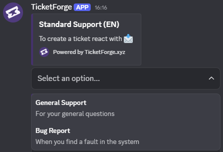

# Interaction Styles

TicketForge supports three distinct ways for users to interact with your panel. You can change this setting in the **Panel Interaction Style** section of the Panel Editor.

## 1. Standard Button

The default style. Displays simple buttons (e.g., "Create Ticket") attached to the message.

<figure markdown>
  { loading=lazy }
  <figcaption>Standard buttons are best for simple, direct actions.</figcaption>
</figure>

- **Best for:** Simple support systems for 1 panel.
- **Configuration:** Go to the **Button Configuration** tab to change the label, color (Primary, Secondary, Success, Danger), and emoji.

## 2. Select Menu (Dropdown)

Replaces buttons with a dropdown menu. This is ideal for saving space when you have many ticket categories.

<figure markdown>
  { loading=lazy }
  <figcaption>Dropdowns organize many options cleanly without cluttering the chat.</figcaption>
</figure>

- **Best for:** Help desks with many departments (Billing, Tech Support, Report, General).
- **Logic:** Each option in the dropdown acts as a "Trigger" that links to another specific panel's logic.

!!! example "How it works"
    1. Create a "Master Panel". Set style to **Select Menu**.
    2. Create a "Billing Panel" (configure its roles and messages).
    3. In the Master Panel, add a dropdown option labeled "Billing Questions" and select the "Billing Panel" as the target.

    When a user selects "Billing Questions", the bot executes the configuration found in the "Billing Panel".

## 3. Multi-Panel Buttons

Combines buttons from multiple different panels into a single message block.

<figure markdown>
  { loading=lazy }
  <figcaption>Group different ticket categories together in one message embed.</figcaption>
</figure>

- **Best for:** Grouping distinct ticket types (e.g., "Apply for Staff" and "Get Support") into one clean embed message.
- **Configuration:**
  1. Set style to **Multi-Panel**.
  2. Select the **Attached Panels** from the dropdown list.
  3. The buttons from those attached panels will appear together under this panel's message.