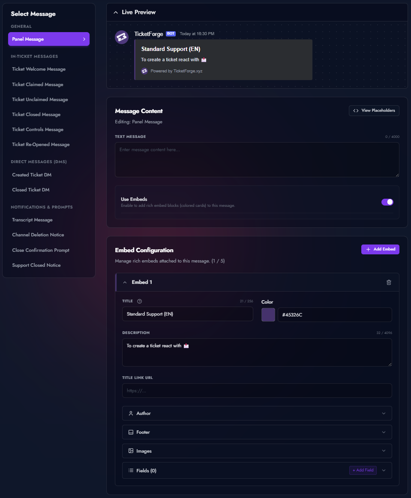
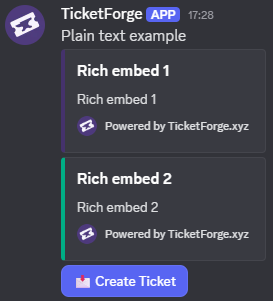

# Messages & Embeds

TicketForge allows you to customize every single interaction the bot has with your users. From the initial panel to the final transcript DM, you have full control over the text, layout, and appearance.

## Message Configuration

Navigate to the **Message Configuration** tab in the Panel Editor. You can configure the following automated messages:

<figure markdown>
  { loading=lazy }
  <figcaption>The visual editor for customizing automated bot messages.</figcaption>
</figure>

### Panel & Ticket Basics

| Message Key         | Description                                                                                                     |
| :------------------ | :-------------------------------------------------------------------------------------------------------------- |
| **Panel Message**   | The permanent message displayed in your channel. Users react or click buttons here to start.                    |
| **Ticket Welcome**  | The first message sent inside the new ticket. Use this to tag support staff (`<@&roleID>`) or welcome the user. |
| **Ticket Controls** | The message attached to the "Close", "Claim", and "Transcript" buttons inside the ticket.                       |

### Lifecycle Events

| Message Key            | Description                                                                                          |
| :--------------------- | :--------------------------------------------------------------------------------------------------- |
| **Ticket Closed**      | Sent into the ticket channel once it enters the "Closed/Archived" state, replacing the controls.     |
| **Ticket Re-Opened**   | Sent if a staff member re-opens a closed ticket.                                                     |
| **Close Confirmation** | Displayed when a user clicks "Close" (if Two-Step Close is enabled). Warns them the action is final. |
| **Channel Deletion**   | The final warning message sent 5 seconds before the channel is actually deleted.                     |

### Staff Actions

| Message Key          | Description                                                                                  |
| :------------------- | :------------------------------------------------------------------------------------------- |
| **Ticket Claimed**   | Sent when a staff member claims the ticket. Useful for telling the user who is helping them. |
| **Ticket Unclaimed** | Sent if a staff member releases a claimed ticket back to the general pool.                   |

### Direct Messages (DMs)

| Message Key     | Description                                                  |
| :-------------- | :----------------------------------------------------------- |
| **DM: Created** | Sent to the user's DMs immediately after they open a ticket. |
| **DM: Closed**  | Sent to the user's DMs when the ticket is closed by staff.   |

### Logs & Misc

| Message Key        | Description                                                                                                       |
| :----------------- | :---------------------------------------------------------------------------------------------------------------- |
| **Transcript Log** | The message posted in your Log Channel containing the file download.                                              |
| **Support Closed** | Displayed if a user tries to open a ticket outside of operating hours (if "Replace Message" schedule mode is on). |

---

## Embed Builder

For every message type, you can have a **Plain Text** message with multiple **Rich Embeds** .

<figure markdown>
  { loading=lazy width="400" }
  <figcaption>A rich embed message generated by TicketForge.</figcaption>
</figure>

- **Author:** Sets the small icon and text at the very top.
- **Title:** The main bold header. Can be a clickable hyperlink.
- **Description:** The main body text. Supports Markdown and variables.
- **Fields:** Add up to 25 structured fields. You can set them to **Inline** to display them side-by-side.
- **Thumbnail:** A small image in the top-right corner.
- **Image:** A large banner image at the bottom.
- **Footer:** Small text and icon at the very bottom. Can display a timestamp.
- **Color:** The vertical strip color on the left side.

---

## Variables & Placeholders

### User & Author
| Variable | Description |
| :--- | :--- |
| `{user_mention}` | Mentions the user (e.g., @Username) |
| `{user_name}` | The user's username |
| `{user_id}` | The user's unique Discord ID |
| `{user_avatar}` | URL of the user's avatar image |
| `{user_nickname}` | The user's server nickname |
| `{user_tag}` | The user's 4-digit discriminator |
| `{user_full}` | Username and discriminator (User#0000) |
| `{author}` | Mentions the staff/user who triggered the action |
| `{author.name}` | The author's username |
| `{author.id}` | The author's unique Discord ID |
| `{author.icon}` | URL of the author's profile picture |

### Ticket & Claiming
| Variable | Description |
| :--- | :--- |
| `{ticket}` | Mentions the ticket channel |
| `{ticket.id}` | The unique ID of the channel |
| `{ticket_opener}` | Mentions the user who created the ticket |
| `{ticket.user.name}` | The ticket owner's username |
| `{claim.user}` | Mentions the staff member who claimed the ticket |
| `{claim.user.name}` | The claimer's username |
| `{claim.user.icon}` | URL of the claimer's profile picture |
| `{ticket_closer}` | Mentions the user who closed the ticket |

### Server & Channel
| Variable | Description |
| :--- | :--- |
| `{server.name}` | The name of your Discord server |
| `{server_members}` | Total member count of the server |
| `{channel_mention}` | Mentions the current channel |
| `{panel.name}` | The name of the panel being used |

### Time & Dates
| Variable | Description |
| :--- | :--- |
| `{time}` | Current Unix time in seconds |
| `<t:{time}>` | Discord native timestamp (e.g., 12 December 2025) |
| `{time.created.age}` | How long ago the ticket was opened |

---

## Variable Modifiers

Add a `?` to any variable to change its format. Example: `{user_name?uppercase}`.

| Modifier | What it does |
| :--- | :--- |
| `?uppercase` | **SHOUTING TEXT** |
| `?lowercase` | **quiet text** |
| `?maxLength=X` | Cuts off text after X characters |
| `?padLeft=X` | Adds zeros to the left (e.g. `{count?padLeft=4}` → 0042) |
| `?fallback=text` | What to show if the variable is empty |
| `?math=+100` | Algebraic operations on numbers or timestamps |
| `?clean` | Removes backticks to prevent breaking code blocks |

### Text Formatting

- `{user.name?uppercase}` or `?uc` -> **USERNAME**
- `{user.name?lowercase}` or `?lc` -> **username**
- `{user.name?maxLength=5}` or `?ml=5` -> **Usern...** (Truncates text)
- `{count?padLeft=3}` or `?pl=3` -> **001**, **045** (Adds leading zeros)
- `{count?padRight=3}` or `?pr=3` -> **100**, **500** (Adds trailing zeros)
- `{variable?clean}` -> Removes backticks (`) to prevent code block breakage

### Logic & Math

- `{variable?fallback=No Value}` or `?fb=...` -> Displays "No Value" if the variable is empty.
- `{variable?notfallback=Has Value}` or `?nfb=...` -> Displays "Has Value" if the variable is NOT empty.
- `{random?rmin=1?rmax=100}` -> Generates a number between 1 and 100.
- `{time?math=+3600}` or `?m=...` -> Adds 3600 seconds (1 hour) to the timestamp. Supported: `+`, `-`, `*`, `/`.

### Examples

**1. Clean Welcome Message**

> "Hello {user}, welcome to {server.name}! Support will be with you shortly."

**2. Formatted Ticket ID**

> "Ticket ID: #{count?padLeft=4}" -> **Ticket ID: #0042**

**3. Conditional Form Data**

> "IGN: {ign?fallback=Not Provided}" -> Displays the user's IGN input from the form, or "Not Provided" if they skipped it.