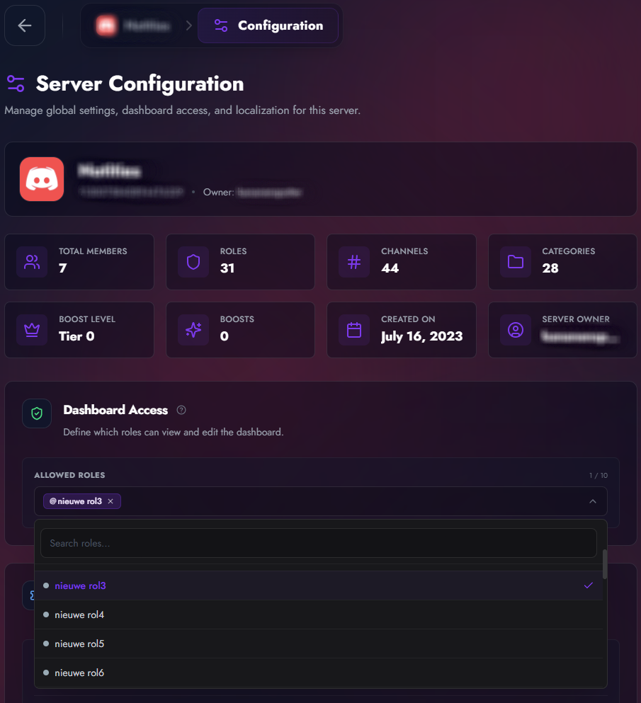
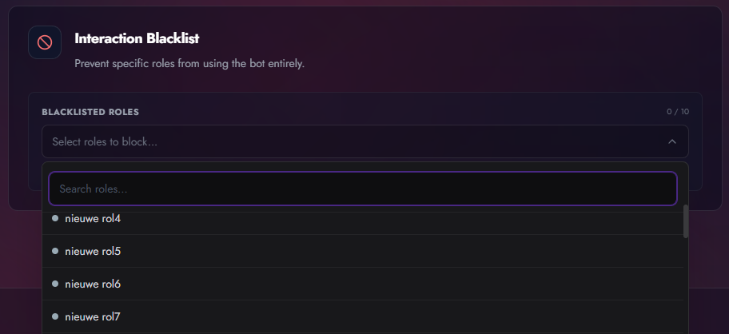
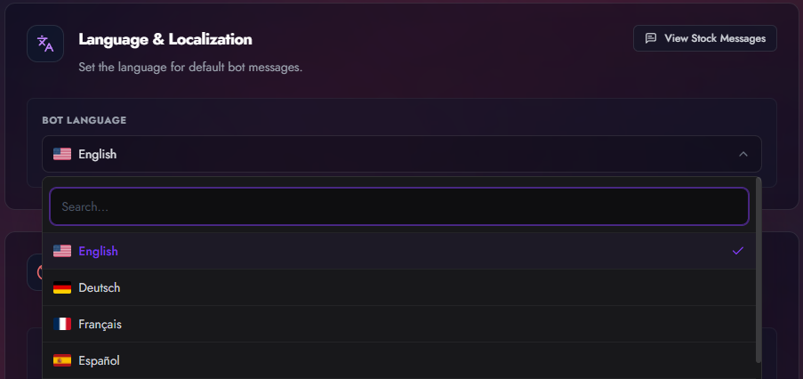

# Roles & Permissions

TicketForge divides permissions into two main categories: **Dashboard Access** and **Ticket Usage**.

## Dashboard Access

By default, only the **Server Owner** and users with the **Administrator** permission in Discord can access the web dashboard.

To grant access to other staff (e.g., "Head Moderator") without giving them full Administrator power:

1.  Go to **Server Config** in the dashboard.
2.  Find **Dashboard Access**.
3.  Select the roles you want to authorize.

<figure markdown>
  { loading=lazy }
  <figcaption>Selecting roles to grant dashboard access.</figcaption>
</figure>

!!! note "Access Level"
    Roles added here will have full access to edit Panels, Messages, and Settings for this specific server. They cannot access Billing or Subscription settings.

## Interaction Blacklist

If you have problematic users or roles that abuse the ticket system, you can blacklist them globally.

1.  Go to **Server Config**.
2.  Find **Interaction Blacklist**.
3.  Select the roles.

<figure markdown>
  { loading=lazy }
  <figcaption>Preventing specific roles from interacting with the bot.</figcaption>
</figure>

**Effect:** Users with these roles cannot click _any_ button, use _any_ dropdown, or execute _any_ slash command associated with the bot.

## Server Language

You can change the language the bot uses for default system messages (e.g., errors, time formatting).

<figure markdown>
  { loading=lazy }
  <figcaption>Setting the bot's default language for the server.</figcaption>
</figure>

## Hierarchy Warning

For TicketForge to manage roles (e.g., adding/removing "Support" roles during claiming), the **TicketForge** bot role must be physically higher in the Discord Server Settings > Roles list than the roles it is trying to manage.